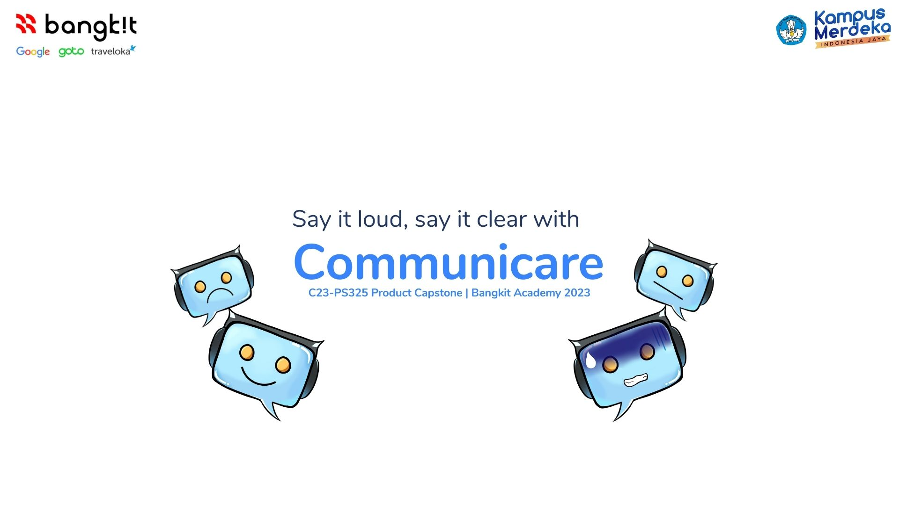

## C23 PS325 Product Capstone - Communicare - Bangkit Academy 2023
Communicare is a mobile application that applies the principles of communication psychology to enhance your communication skills using machine learning technologies.

## Team Members
Machine Learning
- (ML) M360DSX0483 – Muhammad Fadil Maulana Akbar – Telkom University
- (ML) M222DSX0079 – Richard Lois Setiawan – Universitas Kristen Duta Wacana

Cloud Computing
- (CC) C101DKX3830 – M Taufiq Permana Sumarna – STMIK Amik Bandung
- (CC) C017DKX4386 - Almeiza Arvin Muzaki – Institut Teknologi Bandung (ITB)

Mobile Development
- (MD) A360DSX1258 – Arda Ardiyansyah – Telkom University
- (MD) A109DSY1725 – Fani Aghistiya Lestari – STMIK Mardira Indonesia

## Description
Communicare is a mobile application developed as part of the C23 PS325 Product Capstone project for Bangkit Academy 2023. The application leverages the principles of communication psychology and integrates machine learning technologies to improve users' communication skills.

With Communicare, users can expect to enhance their communication abilities through various features and functionalities. The application employs machine learning algorithms to provide personalized recommendations, practice scenarios, and interactive exercises to help users develop effective communication strategies.
